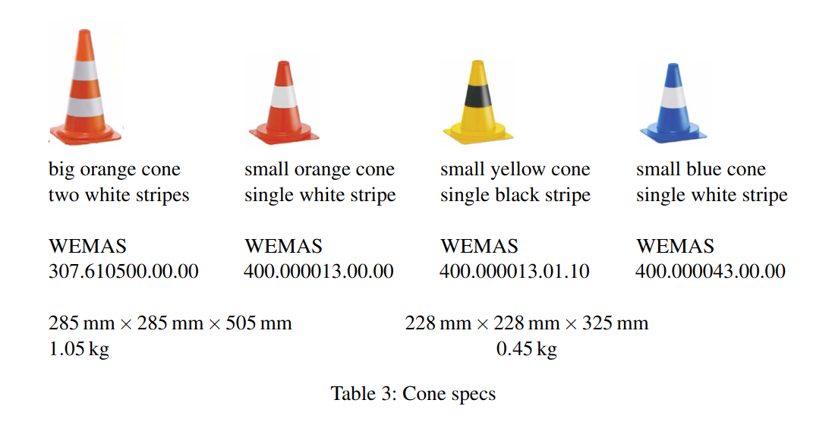

# blender3d_datagen
This is a python module for generating visual/LIDAR datasets to be used with training our models.

## Features
* Reading data from `json` and `blend` files to generate images.
* Randomizing object count/position/rotation using randomization parameters.
* Changing/randomizing lighting conditions using `bpy` project parameters.
* Randomizing camera positioning/height/angle depending on randomization parameters.

## Notes
* The script `run_in_blender.py` is designed to be used inside Blender; this script allows developing scripts with the use of an IDE.
* The cones used in the actual competition has to comply with standards, which can be found to follow
    